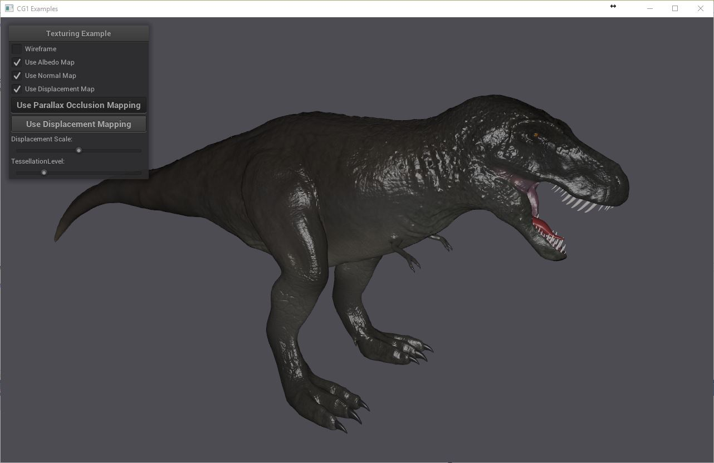

# CG1
Implementation examples for course Computer Graphics 1 / TU Dresden

Build Instructions
----
- Check out the Git repository including submodules (/recursive).
- Use CMake to generate a project for your platform.
- Compile the project.

Usage Instructions
----
In order to run the application, you need the 3D model from https://www.turbosquid.com/3d-models/free-t-rex-zbrush-3d-model/1100937.
However, there are a few modifications necessary:
- Download the OBJ models and textures and extract all files with the folder structure to the `/data/trex` folder.
- Convert the following files to JPG: `Eyes.tif`, `T-REX normal.tif`, `T-REX.BMP`.
- Convert the following files to HDR: `T-REX displacement.tif`.

If the application cannot find the files, you might need to change `dataDirectory` in `main.cpp`.

